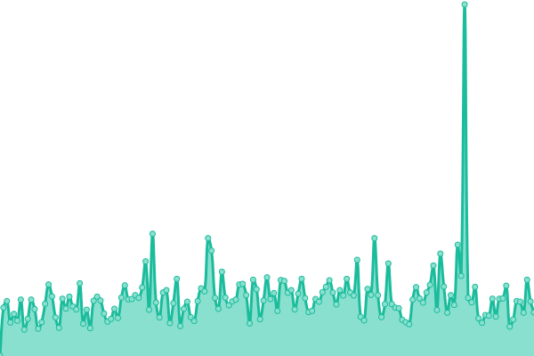
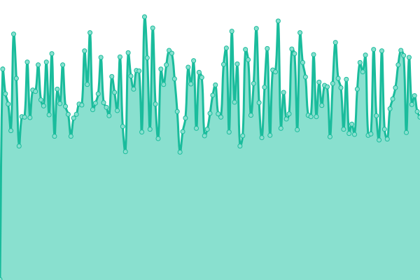
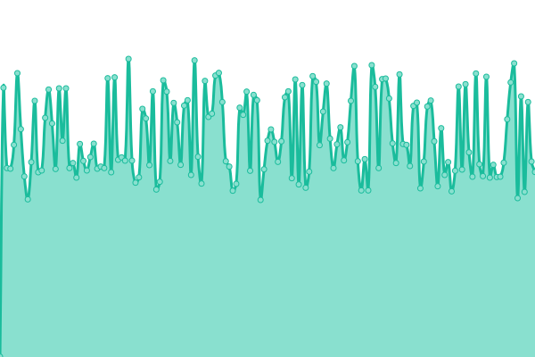
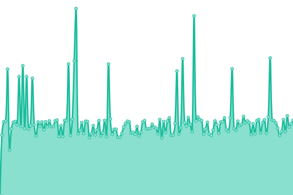

# [📈 Live Status](https://status.k2lin.com): <!--live status--> **🟨 Degraded performance**

This repository contains the open-source uptime monitor and status page for [K2Lin](https://k2lin.com/), powered by [Upptime](https://github.com/upptime/upptime).

With [Upptime](https://upptime.js.org), you can get your own unlimited and free uptime monitor and status page, powered entirely by a GitHub repository. We use [Issues](https://github.com/K2Lin-Daniel/K2Lin_Status/issues) as incident reports, [Actions](https://github.com/K2Lin-Daniel/K2Lin_Status/actions) as uptime monitors, and [Pages](https://status.k2lin.com) for the status page.

<!--start: status pages-->
<!-- This summary is generated by Upptime (https://github.com/upptime/upptime) -->
<!-- Do not edit this manually, your changes will be overwritten -->
<!-- prettier-ignore -->
| URL | Status | History | Response Time | Uptime |
| --- | ------ | ------- | ------------- | ------ |
|  [Main Site](https://k2lin.com) | 🟩 Up | [main-site.yml](https://github.com/K2Lin-Daniel/K2Lin_Status/commits/HEAD/history/main-site.yml) | 

 144ms
     
 | 

<a href="https://status.k2lin.com/history/main-site">100.00%</a>
    

|  [Cloud Music](https://music.k2lin.com) | 🟩 Up | [cloud-music.yml](https://github.com/K2Lin-Daniel/K2Lin_Status/commits/HEAD/history/cloud-music.yml) | 

 151ms
     
 | 

<a href="https://status.k2lin.com/history/cloud-music">100.00%</a>
    

|  [Chat](https://chat.k2lin.com) | 🟩 Up | [chat.yml](https://github.com/K2Lin-Daniel/K2Lin_Status/commits/HEAD/history/chat.yml) | 

 515ms
     
 | 

<a href="https://status.k2lin.com/history/chat">100.00%</a>
    

|  [Auth](https://auth.k2lin.com) | 🟩 Up | [auth.yml](https://github.com/K2Lin-Daniel/K2Lin_Status/commits/HEAD/history/auth.yml) | 

 796ms
     
 | 

<a href="https://status.k2lin.com/history/auth">100.00%</a>
    

|  [OurCraft Network](cloud.k2lin.studio) | 🟨 Degraded | [our-craft-network.yml](https://github.com/K2Lin-Daniel/K2Lin_Status/commits/HEAD/history/our-craft-network.yml) | 

 285ms
     
 | 

<a href="https://status.k2lin.com/history/our-craft-network">99.99%</a>
    

<!--end: status pages-->

[**Visit our status website →**](https://status.k2lin.com)

## 📄 License

- Powered by: [Upptime](https://github.com/upptime/upptime)
- Code: [MIT](./LICENSE) © [K2Lin](https://k2lin.com/)
- Data in the `./history` directory: [Open Database License](https://opendatacommons.org/licenses/odbl/1-0/)
